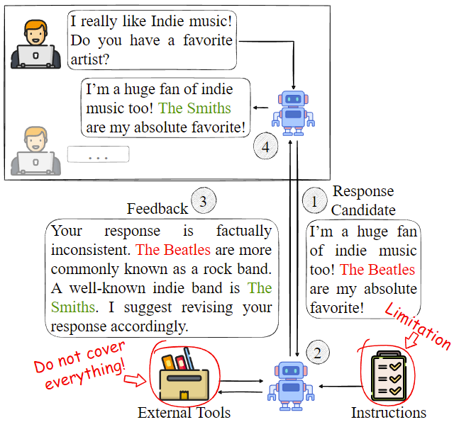
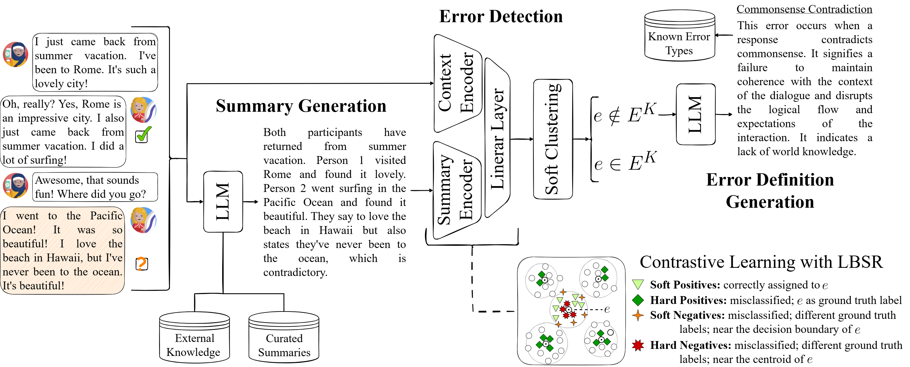

# Towards Automated Error Discovery: A Study in Conversational AI
<!--[](https://arxiv.org)-->
[](https://opensource.org/licenses/Apache-2.0)
[](https://www.python.org/)

## Disclaimer

> This repository contains experimental software and is published for the sole purpose of giving additional background details on the respective publication. 

## Abstract

Although LLM-based conversational agents demonstrate strong fluency and coherence, they continue to exhibit behavioral errors, such as inconsistencies and factual inaccuracies. Detecting and mitigating these errors is critical for developing trustworthy systems. However, current response correction methods rely heavily on large language models (LLMs), which require information about the nature of an error or hints about its occurrence for accurate detection. This limits their ability to identify errors not defined in their instructions or covered by external tools, such as those arising from updates to the response-generation model or shifts in user behavior. 

<p align="center">
</br>Figure 1: LLM-based response correction pipeline: (1) The response-generation model produces an initial response based on user input. (2) The feedback LLM, or in self-correcting systems the response-generation model itself, evaluates the candidate for errors, often using external tools. Recent work shows that LLMs require information about the nature of an error or hints about its occurrence for accurate detection. (3) The response-generation model refines its output according to the feedback.
</p>

In this work, we introduce __Automated Error Discovery__, a framework for detecting and defining behavioral errors in conversational AI, and propose __SEEED__ (<u>S</u>oft-clustering <u>E</u>xtended <u>E</u>ncoder-Based <u>E</u>rror <u>D</u>etection), an encoder-based alternative to LLMs for error detection. We enhance the Soft Nearest Neighbor Loss by amplifying distance weighting for negative samples and introduce __Label-Based Sample Ranking__ to select highly contrastive examples for better representation learning. 

<p align="center">
</br>Figure 2: Schematic overview of SEEED, comprising three distinct components: Summary Generation, Error Detection, and Error Definition Generation (<i>e</i> denotes the identified behavioral error). Our training procedure is illustrated with a focus on the concept of Label-Based Sample Ranking.
</p>

SEEED outperforms adapted baselines across multiple error-annotated dialogue datasets, improving the accuracy for detecting novel behavioral errors by up to 8 points and demonstrating strong generalization to unknown intent detection.

In this repository, we provide the source code for SEEED and the baselines used in the paper. In addition, we provide example shell scripts for running our experiments. For experiments with [FEDI](https://aclanthology.org/2024.findings-emnlp.264/), we used the error-annotated subset of FEDI v2, available at [TU datalib](https://tudatalib.ulb.tu-darmstadt.de/handle/tudatalib/4554). For experiments with [Soda-Eval](https://aclanthology.org/2024.findings-emnlp.684/), we used the dataset as published in the [Huggingface Datahub](https://huggingface.co/datasets/Johndfm/soda_eval), and for experiments with [ABCEval](https://aclanthology.org/2023.acl-long.839/), we used the dataset provided on [GitHub](https://github.com/emorynlp/GPT-ABCEval/tree/main).

## Getting Started
__1. Installation__
We provide a ```pyproject.toml``` file for installing our code as a package in your Python >=3.12 environment. Just run ```pip install -e .``` to install our code and all required dependencies.

__2. Running Our Code__
Navigate to ```scripts```. There you will find one ```.sh``` file for each approach, SEEED, SynCID, LOOP, KNN-Contrastive, and our fine-tuning experiments with Phi-4. Remove the SLURM specific parameters if you are not running the scripts in a SLURM environment, set the required parameters according to your environment, create the required directories, and run the script (or copy the Python command to your shell). Here is a list of all possible parameters:

| Argument   | Description | Approach |
| -------- | ------- | ------- |
| --dataset  | The path or to the dataset to use (from a local directory or Huggingface). | |
| --token | The token to use for downloading the dataset from Huggingface. | |
| --novelty | The ration of classes to randomly sample as novel. | |
| --n_labels | The list of classes to treat as novel (alternative to 'novelty'), e.g., for a subsequent run in a multi-stage training approach. Will always override 'novelty'. | |
| --error_turn | Whether or not to use the whole error turn instead of just the error utterance. | |
| --model_path | The path to a pretrained huggingface model (the foundation model to be used). | |
| --pretrained | The path to a model pretrained using this framework. | |
| --batch_size | The number of samples per batch. | |
| --epochs | The number of epochs for the main training. | |
| --epochs_2 | The number of epochs for the second training stage (if required). | SynCID, LOOP|
| --device | The device to use for training ('cuda' or 'cpu').| |
| --save_dir | The directory where to save the trained model. | |
| --experiment | The name of the experiment (for MLFlow). | |
| --visualize | Whether or not to visualize the representation space after evaluation. | |
| --contrastive_weighting | Weighting factor for contrastive learning. | SEEED, KNNContrastive|
| --topk | The number of top-k samples to consider for calculating inconsistency. | SEEED |
| --positives | The number of positive samples per error type | SEEED, KNNContrastive |
| --num_negatives | The number of negative samples per error type. | SEEED |
| --resample_rate | The ration of epochs after which to resample the dataset for contrastive learning. | SEEED |
| --error_types | The data type for loading the correct error definitions and templates | Phi-4, LOOP |
| --alpha | The weighting factor for the unsupervised contrastive loss. | SynCID |
| --beta | The weighting factor for the supervised contrastive loss. | SynCID |

In our experiments with SEEED, we only used one positive and negative counterpart per sample, but theoretically, there is no upper limit.

## Automated Error Discovery
We distinguish two sub-tasks, <u>Error Detection</u> and <u>Error Definition Generation</u>, and define the following formal setup:

- $E = E^K \cup E^U$ is the set of all behavioral error types. $E^K = \{(e_i, d_i)\}_{i=1}^m$ is the set of known error types, with $e_i$ as the error identifier and $d_i$ as its definition. $E^U$ denotes the set of unknown error types. $E^K \cap E^U = \emptyset$.
- $C = C^K \cup C^U$ denotes the set of all dialogue contexts $T$, with $C^{K}$ as the set of all $T$ associated with a behavioral error $e$ from $E^{K}$. $C^{U}$ is the set of dialogues associated with unknown behavioral errors. $C^K \cap C^U = \emptyset$.
- We define a dialogue context $T$ as a sequence of user-agent utterances (turns). Depending on the use case, $T$ may be associated with additional features, such as external knowledge documents in knowledge-grounded dialogues. We refer to these additional features as $W_T$. In this work, $W$ is relevant only as external knowledge in the knowledge-grounded subset of FEDI.

### Error Detection
Given an error detection function $\mathcal{H}: \mathbb{R}^{d} \mapsto \mathbb{N}$ and a dialogue context $T \in C$, the task is to determine the behavioral error $e \in E$ associated with the last agent utterance in $T$:

$$e = \mathcal{H}(T, W_T), \text{ where } e \in E \text{ and } T \in C$$

$\mathcal{H}$ must not access any data in $E^{U}$ during training.

### Error Definition Generation
When $e \notin E^{K}$, the task is to generate a definition $d$ conditioned on the identified set of related dialogue contexts $C_{e} \subseteq C^{U}$.\footnote{In practical implementations, this new data can be used to enhance $\mathcal{H}$. To avoid the emergence of an overly granular set of behavioral errors, we suggest applying a threshold to $\left |C_e \right |$.}

## Citation

Please reference our work as follows:

```

```

## Contact Persons

Dominic Petrak (<petrak@ukp.informatik.tu-darmstadt.de>)
  
## Links

[UKP Lab Homepage](https://www.ukp.tu-darmstadt.de/) | [TU Darmstadt Website](https://www.tu-darmstadt.de/index.en.jsp)
